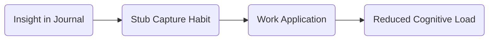

# Executive Function (EF) Transfer Map Template

The purpose of this template is to show how an insight discovered during journaling can be transferred into real-world application.

---

## Goal
*(What skill, habit, or cognitive process are you trying to improve?)*  
Example: Reduce time blindness in morning routines.

---

## Discovery
*(Original insight or idea captured during journaling)*  
Example: “When I write stubs in real time, I can re-enter the idea later without losing context.”

---

## Real-World Application
*(How will you apply this insight outside the journaling session?)*  
Example: Use stub capture during Zoom calls to avoid derailment, then expand later.

---

## Transfer Path
- Immediate Use: Journaling → clarity
- Work Integration: Note-taking strategy in meetings
- Tool Link: Markdown log → shared project doc

---

### Optional: Mermaid Diagram Example

